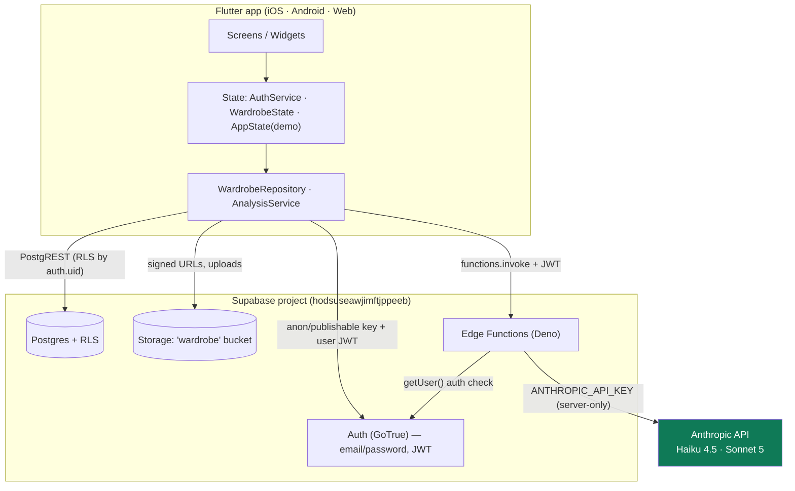
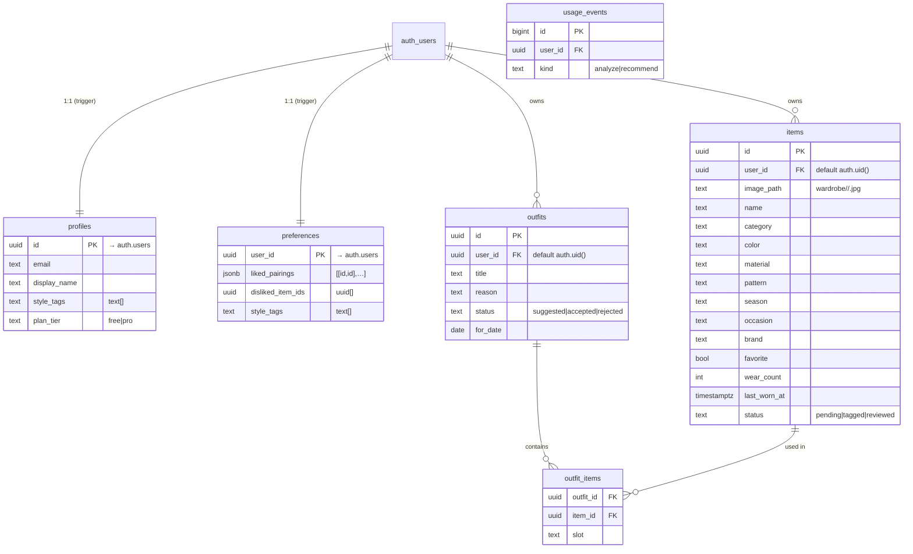
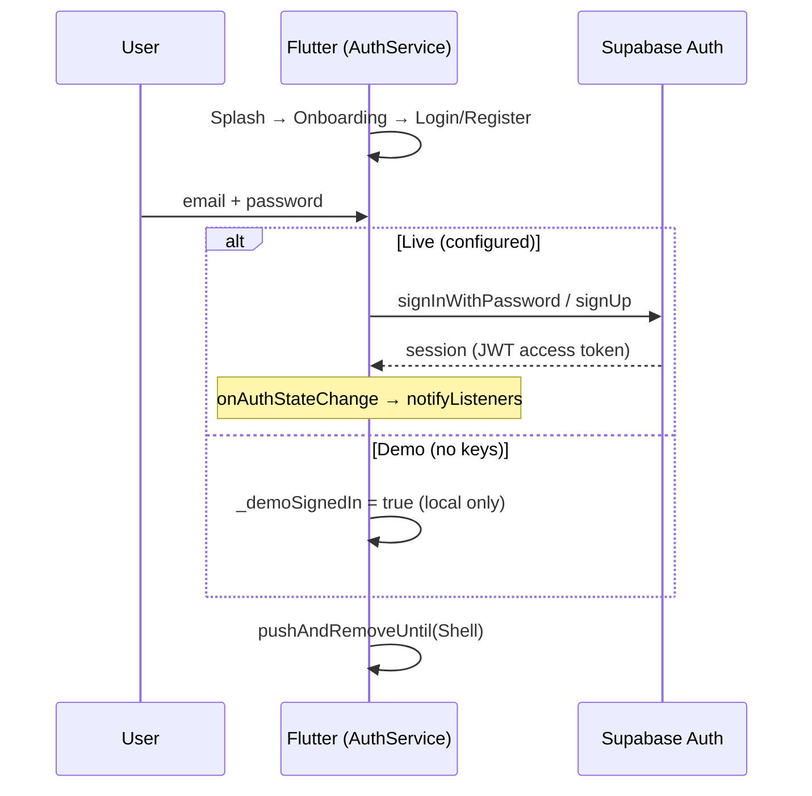
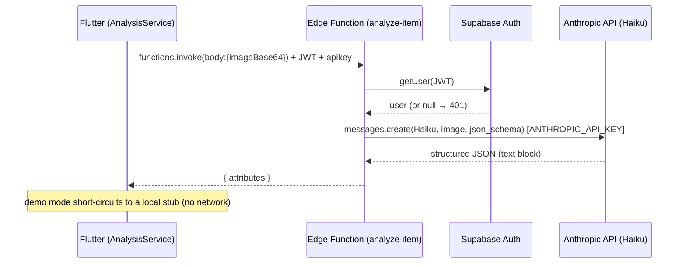
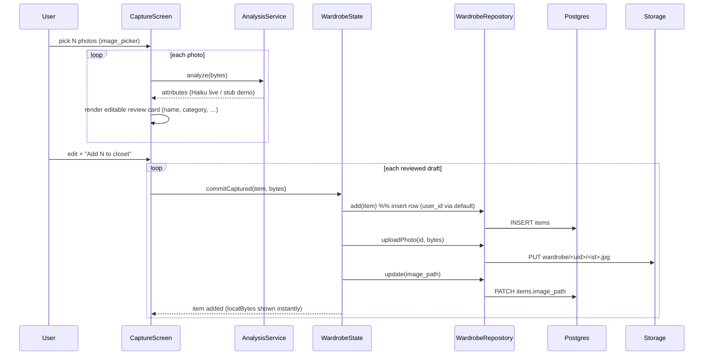

# Vess — Technical Handoff

**Status:** M0–M2 complete (foundation, wardrobe, capture). M3 (recommendations) next.
**Last updated:** 2026-07-24
**Stack:** Flutter 3.7.12 / Dart 2.19.6 · Supabase (Postgres + Auth + Storage + Edge Functions) · Claude (Haiku 4.5 vision, Sonnet 5 recommendations)

Vess is an AI wardrobe app: users photograph their clothes, AI tags each garment, and the app recommends outfits from their own pieces with an explanation. This document captures the current state for anyone (human or agent) picking up the work.

> **The one thing blocking "real AI" today:** the `ANTHROPIC_API_KEY` secret is **not set** in Supabase Edge Functions. Everything else is deployed and verified; the two AI functions return HTTP 500 until the key is added (dashboard → Edge Functions → Secrets). Until then the app runs in a **demo mode** with stubbed AI so it's always usable.

---

## 1. Overall architecture



**Key principle — the API-key spine:** the Anthropic key lives **only** as an Edge Function secret. The Flutter app never holds it; all Claude calls go app → Edge Function → Anthropic. The app only ever holds the Supabase *publishable/anon* key, which is safe to ship because Row Level Security governs what it can touch.

**Two runtime modes:**
- **Live** — `SUPABASE_URL` + `SUPABASE_ANON_KEY` supplied via `--dart-define` **and** a user is signed in. Real Postgres/Storage/Functions.
- **Demo** — no keys (or not signed in). In-memory seed data, stubbed AI. Keeps the app runnable end-to-end for development and review.

---

## 2. Flutter folder structure

```
lib/
├── main.dart                 # Supabase.init + MultiProvider(AuthService, AppState, WardrobeState)
├── core/
│   ├── config.dart           # SUPABASE_URL / SUPABASE_ANON_KEY via --dart-define; isConfigured
│   └── supabase_service.dart # Supabase.initialize wrapper; isReady, client
├── data/
│   ├── mock_data.dart        # kCloset, kCategories, kOnboarding, kInsights (prototype only)
│   ├── models/
│   │   └── item.dart         # ★ REAL model: Item {…, status, localBytes}; fromMap/toInsert/copyWith
│   └── wardrobe_repository.dart  # ★ Supabase CRUD: fetchItems, add, update, remove, uploadPhoto, signedUrl
├── models/
│   └── closet_item.dart      # Prototype gradient model (demo Home/Builder/Stylist)
├── services/
│   ├── auth_service.dart     # ★ email/password auth + demo fallback (ChangeNotifier)
│   └── analysis_service.dart # ★ analyze(bytes): live→invoke('analyze-item'), demo→stub
├── state/
│   ├── app_state.dart        # Prototype state (mock closet, outfit builder, stylist chat) — demo screens
│   └── wardrobe_state.dart   # ★ REAL wardrobe state: load, add, updateItem, toggleFavorite, remove, commitCaptured
├── theme/
│   ├── tokens.dart           # VessTokens ThemeExtension (light/dark, ported from design doc)
│   └── app_theme.dart        # buildVessTheme, kSans/kSerif, serif(), eyebrow()
├── widgets/
│   ├── common.dart           # Swatch, VessCard, VessChip, VessBackButton, AccentButton
│   └── item_image.dart       # ★ ItemImage (localBytes > signed URL > color swatch); swatchColor()
└── screens/
    ├── splash_screen.dart, onboarding_screen.dart
    ├── login_screen.dart, register_screen.dart   # ★ real auth wired
    ├── body_scan_screen.dart                      # ⚠ DEAD CODE (deferred feature, unrouted)
    ├── shell.dart                                 # 5-tab container
    ├── home_screen.dart      # demo (AppState / ClosetItem)
    ├── closet_screen.dart    # ★ REAL (WardrobeState) — Add sheet → Capture or Manual
    ├── capture_screen.dart   # ★ REAL batch photo capture + AI review
    ├── add_item_screen.dart  # ★ REAL manual add/edit
    ├── item_detail_screen.dart # ★ REAL item detail (edit/favorite/delete)
    ├── detail_screen.dart    # demo item detail (ClosetItem, used by Home "recently worn")
    ├── builder_screen.dart   # demo (outfit builder prototype)
    ├── stylist_screen.dart   # demo (canned chat prototype)
    └── profile_screen.dart   # demo + real sign-out

test/  auth_test · wardrobe_test · capture_test · widget_test · contrast_test   (24 tests, all passing)
```

★ = real/production path (M1–M2).  Screens marked "demo" still use the prototype `AppState`/`ClosetItem` and migrate to the real wardrobe in **M3**.

---

## 3. Supabase schema (tables, relations, RLS)

Project ref: `hodsuseawjimftjppeeb` · Region: eu-west-1 · Migration: `supabase/migrations/0001_init.sql`



**Row Level Security — enabled on every table.** Each policy scopes rows to the authenticated user:

| Table | Policy | Rule |
|---|---|---|
| `profiles` | select, update | `auth.uid() = id` |
| `items` | all | `auth.uid() = user_id` (with-check same) |
| `outfits` | all | `auth.uid() = user_id` |
| `outfit_items` | all | via parent `outfits.user_id = auth.uid()` (EXISTS subquery) |
| `preferences` | all | `auth.uid() = user_id` |
| `usage_events` | select only | `auth.uid() = user_id`; inserts done by functions (service role) |

**Critical detail:** `items.user_id` and `outfits.user_id` have `DEFAULT auth.uid()`. The client inserts **without** `user_id`; PostgREST fills it from the caller's JWT, and RLS's with-check confirms it. (A missing default was a real bug found and fixed during M1 verification.)

**Signup trigger:** `handle_new_user()` (SECURITY DEFINER) fires `after insert on auth.users` → creates the matching `profiles` and `preferences` rows automatically.

---

## 4. Storage structure

- **Bucket:** `wardrobe` — **private** (not public).
- **Object path:** `<user_id>/<item_id>.jpg` — one folder per user.
- **RLS policies** on `storage.objects` (read / insert / delete): allowed only when `(storage.foldername(name))[1] = auth.uid()::text` — a user can only touch their own folder.
- **Access:** the app never uses public URLs; it requests short-lived **signed URLs** (`createSignedUrl`, 1 h) to display photos. Verified: upload → link → signed-URL fetch returns byte-identical image; anonymous read is blocked (400).

---

## 5. Edge Functions overview

Deno functions under `supabase/functions/`. Both deployed (via dashboard, CORS inlined), **Verify-JWT = OFF** (they authenticate the caller in-code via `getUser()`).

| Function | Model | Input | Output | Notes |
|---|---|---|---|---|
| `analyze-item` | `claude-haiku-4-5` (vision) | `{ imageBase64, mediaType }` | `{ attributes: {name, category, color, material, pattern, season, occasion, brand} }` | Structured JSON output (`output_config.format`, enum-constrained). Bounded classification. |
| `recommend` | `claude-sonnet-5` (adaptive thinking, effort=medium) | `{ items[], occasion, weather }` | `{ outfit: {title, item_ids[], reason} }` | `narrowCandidates()` rules gate (currently occasion-only — expand in M3), then LLM picks + explains. |

Both: verify `Authorization` JWT via `supabase.auth.getUser()` → 401 if absent; read `ANTHROPIC_API_KEY` from env; wrap Claude call in try/catch → 500 on failure. Endpoints: `https://hodsuseawjimftjppeeb.supabase.co/functions/v1/{analyze-item|recommend}`.

> Repo copies import `../_shared/cors.ts`; the **deployed** copies inline the same CORS constant so they deploy as a single file from the dashboard editor. For CLI deploys (`supabase functions deploy`), the repo `_shared` version is canonical. Keep the two in sync, or switch fully to CLI deploys.

---

## 6. Authentication flow



- `AuthService` (ChangeNotifier) wraps Supabase email/password and exposes `isSignedIn`, `isConfigured`, `signIn/signUp/signOut`.
- The **session JWT** is then attached automatically by `supabase_flutter` to every PostgREST/Storage/Functions call → drives RLS and function auth.
- Social sign-in (Apple/Google) buttons are present but stubbed ("coming soon"). Email-confirmation projects: sign-up shows a "check your email" toast (no session yet).

---

## 7. AI request flow



The `recommend` flow is identical in shape (Sonnet 5, `{items,occasion,weather}` → `{outfit}`), with server-side rules narrowing candidates before the model call.

---

## 8. Data flow: Capture → Analysis → Database



`Item.localBytes` (transient, never persisted) lets the just-captured photo render immediately without waiting on a signed-URL round-trip.

---

## 9. Known limitations

**Blocking real AI**
- `ANTHROPIC_API_KEY` secret **not set** → `analyze-item` / `recommend` return 500. Add it in the dashboard; nothing else is required.

**Platform / tooling**
- **Flutter 3.7.12 / Dart 2.19** is ~2 years old. It pins `supabase_flutter 1.x` and `image_picker 1.0.x` and blocks Dart 3 (records, patterns, sealed classes). **Recommend upgrading Flutter** before the codebase grows further.
- Functions read the **deprecated** `SUPABASE_ANON_KEY` env var (still present). Migrate to `SUPABASE_PUBLISHABLE_KEYS` when convenient.
- Windows native builds need Developer Mode (plugin symlinks); web builds are unaffected.

**Product scope (by design, this milestone)**
- **Home / Builder / Stylist tabs are still the demo prototype** (mock `AppState`). Only the **Closet** tab + item detail + capture are real. Migrate the rest in M3.
- No free-tier quota enforcement yet (usage_events table exists; enforcement is M4).
- `recommend` rule-narrowing is a stub (occasion filter only) — real color/formality/weather/no-repeat rules are M3.
- No offline support or caching; errors surface as toasts only. Signed URLs are re-fetched (no image cache).

**Tech debt**
- Two garment models coexist: `ClosetItem` (prototype gradients) and `Item` (real). Collapses once demo screens migrate.
- `body_scan_screen.dart` is dead code (deferred feature).
- Deployed functions and repo functions differ only in the CORS import style — keep in sync.
- Preview-pane (headless canvas) rendering of the Flutter web build is flaky under DPR/resize; a harness quirk, not an app bug. Verify UI on a real device or `flutter run -d chrome`.

---

## 10. TODOs by milestone

**M3 — Recommendations (next)**
- [ ] "What should I wear?" screen → call `recommend` with the user's real items + weather/occasion.
- [ ] Render the outfit + the **"why"** explanation; Accept / Reject actions.
- [ ] Persist outfits (`outfits` + `outfit_items`); accept/reject → update `preferences` (liked_pairings, disliked_item_ids).
- [ ] Expand `narrowCandidates()`: color harmony, formality matching, weather fit, don't-repeat-yesterday, respect disliked items.
- [ ] **Migrate Home / Builder / Stylist off the demo `AppState`** onto `WardrobeState` + real recommendations; retire `ClosetItem`, `mock_data.dart`, `detail_screen.dart`, `app_state.dart` where possible.

**M4 — Monetization**
- [ ] RevenueCat integration (mobile IAP; Stripe not usable for mobile digital goods).
- [ ] Free-tier limits: item cap (~20) + weekly rec quota, enforced via `usage_events` inserts in the Edge Functions (`TODO(M4)` markers already in place).
- [ ] Paywall UI; `profiles.plan_tier` gating.

**Later**
- [ ] On-device camera capture (not just gallery), background/async tagging, auto-crop/background-clean.
- [ ] Real preference learning loop beyond heuristics.
- [ ] Deferred verticals: shopping, calendar planning, travel packing, body scan.

**Infra / quality**
- [ ] Upgrade Flutter → Dart 3; move to `supabase_flutter 2.x` + publishable keys.
- [ ] Pin the Anthropic SDK version in the Edge Functions.
- [ ] Standardize function deploys on the CLI (with `_shared/`), or a CI pipeline.
- [ ] Add integration tests against a live/staging project (RLS, storage, functions).

---

## Appendix — run & deploy

```bash
# Run the app (real backend). Keys via --dart-define; see S:/vess/run.ps1 (git-ignored).
flutter run -d chrome \
  --dart-define=SUPABASE_URL=https://hodsuseawjimftjppeeb.supabase.co \
  --dart-define=SUPABASE_ANON_KEY=<publishable_or_anon_key>

# No --dart-define → demo mode (always runnable).

flutter test        # 24 tests
flutter analyze     # clean

# Backend: schema is already applied; functions are already deployed.
# Remaining: set the Anthropic secret, then AI is live.
#   dashboard → Edge Functions → Secrets → ANTHROPIC_API_KEY
```

Full backend setup (CLI path) is in `supabase/README.md`. Product strategy/PRD lives in the Vess PRD artifact.
